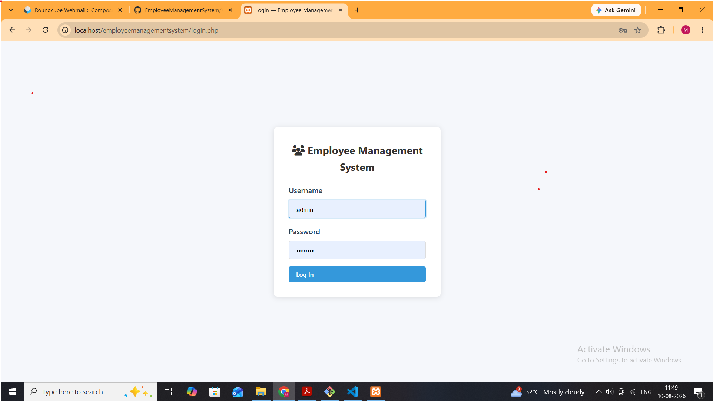
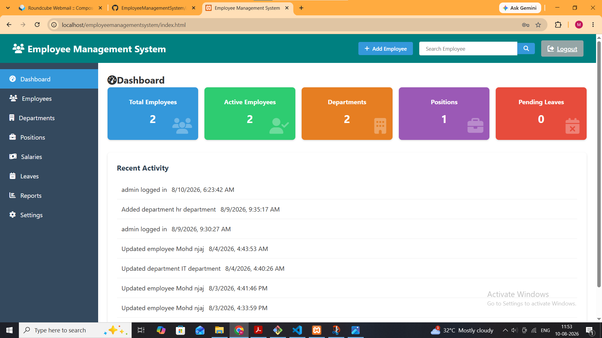
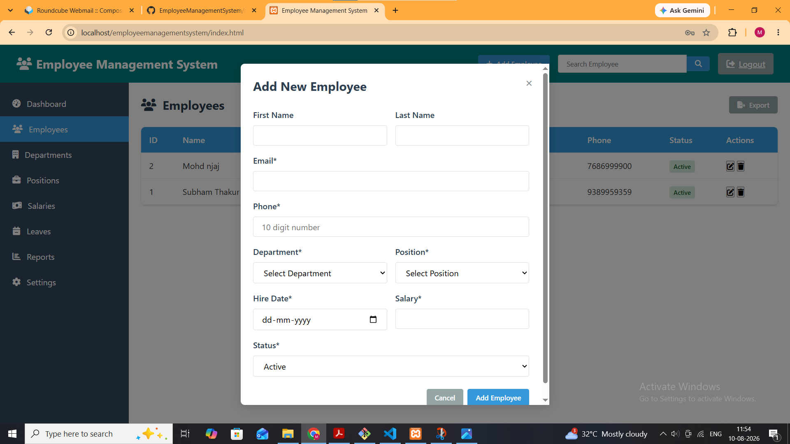
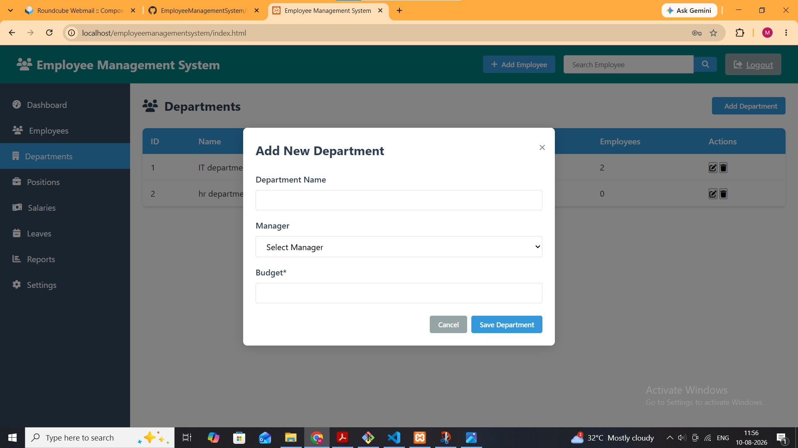
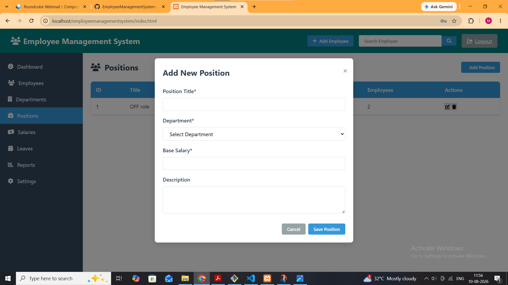
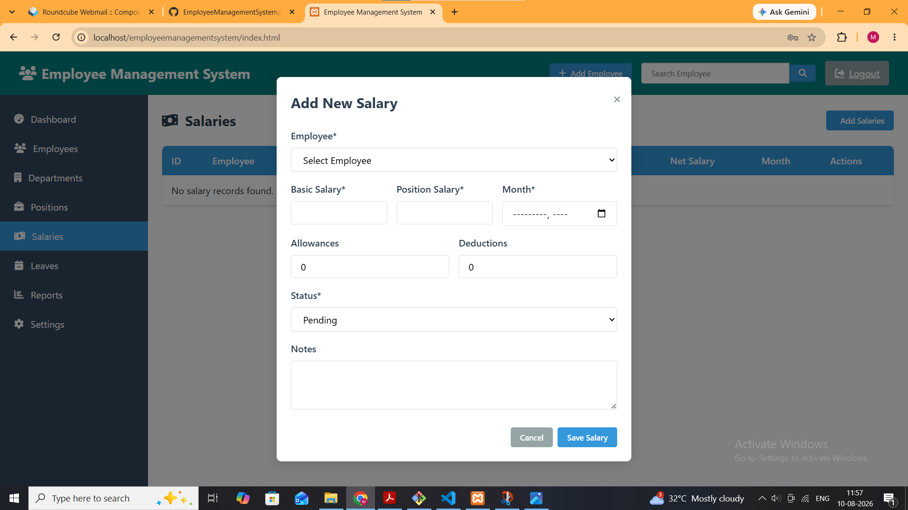
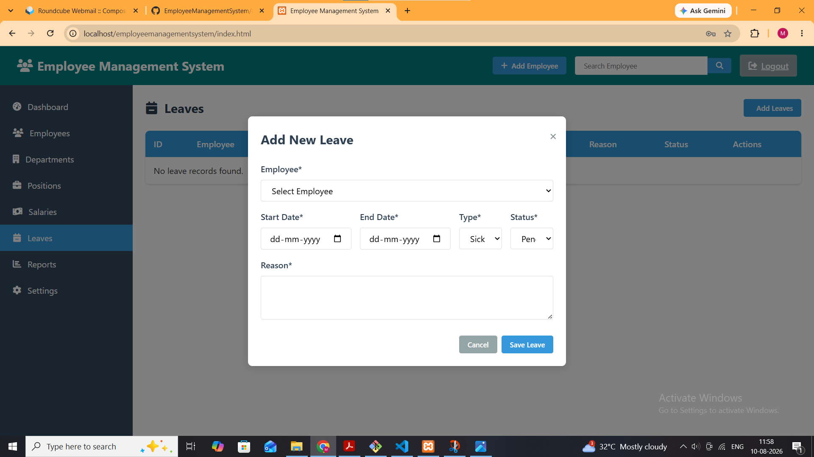
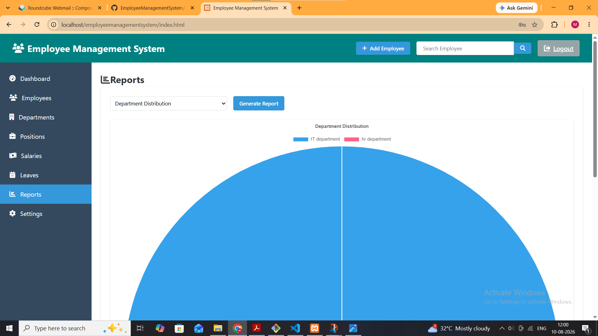
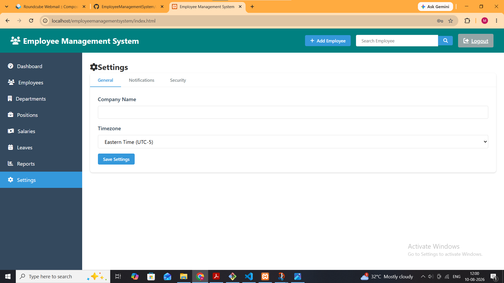

# Employee Management System
---

## 📌 Project Overview

The Employee Management System centralizes common HR operations in one application.

### Key Features

- 🔐 Admin Login & Logout
- 👨‍💼 Employee Management
- 🏢 Department Management
- 💼 Position Management
- 💰 Salary Management
- 📅 Leave Management
- 🔎 Employee Search
- 📊 Reports & Charts
- ⚙️ Application Settings
- 🗄️ SQLite Database
- ✅ Form Validation

---

# 🖥️ Application Screenshots

> **Important:** The screenshots below are linked to the `screenshots/` folder in this repository.  
> Keep the folder structure exactly as shown:
>
> ```text
> EmployeeManagementSystem/
> ├── README.md
> └── screenshots/
>     ├── login.png
>     ├── dashboard.png
>     ├── add-employee.png
>     ├── add-department.png
>     ├── add-position.png
>     ├── add-salary.png
>     ├── add-leave.png
>     ├── reports.png
>     └── settings.png
> ```

---

## 🔐 1. Admin Login

The administrator first accesses the system through the login page.

<p align="center">
  
</p>

**Login functionality includes:**
- Username
- Password
- Admin authentication
- Secure access to the dashboard

---

## 📊 2. Dashboard

After successful login, the administrator is taken to the main dashboard.

<p align="center">
  
</p>

**Dashboard displays:**
- Total Employees
- Active Employees
- Departments
- Positions
- Pending Leaves
- Recent Activity

---

## 👨‍💼 3. Add New Employee

The employee module allows the administrator to add complete employee information.

<p align="center">
  
</p>

**Employee fields include:**
- First Name
- Last Name
- Email
- 10-digit Phone Number
- Department
- Position
- Hire Date
- Salary
- Status

---

## 🏢 4. Add New Department

The department module allows the administrator to create departments.

<p align="center">
  
</p>

**Department fields include:**
- Department Name
- Manager
- Budget

The department table also displays the number of employees assigned to each department.

---

## 💼 5. Add New Position

Positions can be created and linked to a department.

<p align="center">
  
</p>

**Position fields include:**
- Position Title
- Department
- Base Salary
- Description

---

## 💰 6. Add New Salary

The salary module records employee salary information.

<p align="center">
  
</p>

**Salary fields include:**
- Employee
- Basic Salary
- Position Salary
- Month
- Allowances
- Deductions
- Status
- Notes

---

## 📅 7. Add New Leave

The leave module records employee leave requests.

<p align="center">
  
</p>

**Leave fields include:**
- Employee
- Start Date
- End Date
- Leave Type
- Leave Status
- Reason

---

## 📈 8. Reports

The Reports section provides visual analytics such as department-wise employee distribution.

<p align="center">
  
</p>

The report section can be used to generate visual information for easier HR analysis.

---

## ⚙️ 9. Settings

The Settings page provides configuration options for the application.

<p align="center">
  
</p>

**Settings include:**
- General Settings
- Company Name
- Timezone
- Notifications
- Security

---

# 🔄 System Workflow

```text
                    ┌───────────────────┐
                    │    Admin Login    │
                    └─────────┬─────────┘
                              │
                              ▼
                    ┌───────────────────┐
                    │     Dashboard     │
                    └─────────┬─────────┘
                              │
        ┌─────────────────────┼─────────────────────┐
        │                     │                     │
        ▼                     ▼                     ▼
┌───────────────┐     ┌────────────────┐    ┌───────────────┐
│   Employees   │     │  Departments   │    │   Positions   │
└───────┬───────┘     └────────────────┘    └───────────────┘
        │
        ├──────────────────────┐
        ▼                      ▼
┌───────────────┐       ┌───────────────┐
│    Salaries   │       │     Leaves    │
└───────────────┘       └───────────────┘
        │                      │
        └──────────┬───────────┘
                   ▼
          ┌───────────────────┐
          │      Reports     │
          └─────────┬─────────┘
                    ▼
          ┌───────────────────┐
          │     Settings      │
          └───────────────────┘
```

---

# 🗃️ Data Relationship Overview

```text
                   ┌──────────────┐
                   │ Departments  │
                   └──────┬───────┘
                          │
                   ┌──────▼───────┐
                   │  Positions   │
                   └──────┬───────┘
                          │
┌──────────────┐    ┌────▼─────────┐
│   Salaries   │◄───│   Employees  │
└──────────────┘    └────┬─────────┘
                          │
                          ▼
                   ┌──────────────┐
                   │    Leaves    │
                   └──────────────┘
```

---

# 🛠️ Technology Stack

| Technology | Purpose |
|---|---|
| HTML5 | Application structure |
| CSS3 | Styling and responsive UI |
| JavaScript | Client-side interaction and validation |
| PHP | Server-side logic |
| SQLite | Relational database |
| Chart.js | Report visualization |
| XAMPP | Local Apache/PHP environment |
| Git & GitHub | Version control |

---

# 📁 Project Structure

```text
EmployeeManagementSystem/
│
├── api/
├── assets/
├── data/
│   └── employee_management.sqlite
├── screenshots/
│   ├── login.png
│   ├── dashboard.png
│   ├── add-employee.png
│   ├── add-department.png
│   ├── add-position.png
│   ├── add-salary.png
│   ├── add-leave.png
│   ├── reports.png
│   └── settings.png
├── login.php
├── db.php
├── index.html
├── create_admin.php
└── README.md
```

---

# ⚙️ Installation

### 1. Install XAMPP

Start **Apache** from the XAMPP Control Panel.

### 2. Copy the Project

Place the project inside:

```text
C:\xampp\htdocs\
```

Example:

```text
C:\xampp\htdocs\EmployeeManagementSystem
```

### 3. Check the Database

Make sure:

```text
data/employee_management.sqlite
```

exists.

### 4. Open in Browser

```text
http://localhost/EmployeeManagementSystem/
```

---

# 🔒 Validation

The employee form validates important information.

### Phone Number

The phone number should contain exactly **10 digits**.

```text
9876543210  → Correct
987654321   → Incorrect
98765432101 → Incorrect
98AB543210  → Incorrect
```

---

# 🔁 Git Workflow

```bash
git status
git add .
git commit -m "Update Employee Management System"
git push
```

Check remote:

```bash
git remote -v
```

---

# 🧪 Testing Checklist

- [ ] Admin login works
- [ ] Logout works
- [ ] Employee can be added
- [ ] Employee can be edited
- [ ] Employee can be deleted
- [ ] Employee search works
- [ ] 10-digit phone validation works
- [ ] Department can be added
- [ ] Position can be added
- [ ] Salary can be recorded
- [ ] Leave can be recorded
- [ ] Reports generate correctly
- [ ] Settings can be saved
- [ ] SQLite database works correctly

---

# 🎯 Project Objectives

1. Digitize employee record management.
2. Centralize HR information.
3. Reduce manual data management.
4. Provide an easy-to-use admin dashboard.
5. Manage employee salaries and leaves.
6. Generate useful HR reports.
7. Demonstrate practical full-stack development.

---

# 🔮 Future Enhancements

- Role-based access control
- Employee self-service portal
- Attendance management
- Payroll automation
- Email notifications
- PDF/Excel report export
- Cloud deployment
- REST API integration
- Automated database backup

---

# 👨‍💻 Author

**Mohd Owaish Aftab**

**Project:** Employee Management System

**GitHub:** `https://github.com/owais321123/EmployeeManagementSystem`

---

## ⭐ Project Summary

The **Employee Management System** demonstrates practical implementation of **PHP, SQLite, HTML, CSS, JavaScript, CRUD operations, authentication, validation, reporting and Git/GitHub version control**.
